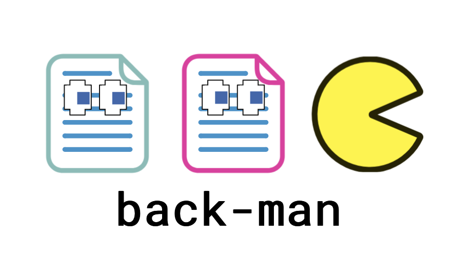

# backman #
A command-line tool for managing and automating lab data backups to Google Cloud Storage (GCS).

### Requirements ###

- Python 3.11+
- uv
- A Google Cloud Storage bucket
- A GCP service account credentials JSON file with Storage Object Admin (or higher) permissions

### Installation ###
```bash
# clone the Git repo
git clone https://github.com/kabanovskyd/backman.git
cd backman

# run the backman installer
bash backman-installer.sh

# reload the bashrc file to export the modified PATH variable
source ~/.bashrc
```
After installation, backman will be available as a system command.

### Setup ###
Initialize a new backman configuration:
bashbackman init
This will prompt you for:

Your GCS bucket name
Path to your GCP credentials JSON file

The configuration is saved to backman.yaml in the current directory.

### Configuration ###
`backman` stores its configuration in a `backman.yaml` configuration file (Backfile):
```yaml
bucket: my-backup-bucket
credentials_path: /path/to/credentials.json
directories:
  /data/lab/project1:
    active: true
    last_backup: "2026-03-10T14:23:00"
  /data/lab/project2:
    active: false
    last_backup: "2026-01-05T09:00:00"
```
Backfiles can be edited manually, but it is generally recommended to interact with them only through `backman` commands as this is guaranteed to preserve the internal structure of the files required for correct functioning.

### Commands ###
- ```backman init``` - initialize a new backman configuration file (Backfile).
    - Note: this will **overwrite** an existing Backfile! Use this only when you want to start from scratch
- ```backman status``` - list all tracked directories and show which files are out of date.
- ```backman update``` - Run a backup on all active directories, uploading any new or modified subdirectories/files.
backman add
Add one or more directories to the config file.
bashbackman add /data/lab/project1 /data/lab/project2
backman exclude
Exclude one or more directories from future backups. The directories remain in the config file but are marked as inactive.
bashbackman exclude /data/lab/project1 /data/lab/project2
backman include
Re-include one or more previously excluded directories.
bashbackman include /data/lab/project1
backman set-bucket
Set the destination GCS bucket.
bashbackman set-bucket my-new-bucket
backman set-auth
Set the path to your GCP credentials JSON file.
bashbackman set-auth /path/to/credentials.json
backman help
Print the help menu.
bashbackman help

#### Options ####
A custom config file path can be specified for any command:
bashbackman --config /custom/path/backman.yaml status

GCP Permissions
The GCP service account associated with your credentials file requires at minimum:
PermissionPurposeStorage Object AdminUpload, download, and delete objects in the bucketStorage Legacy Bucket ReaderCheck if the bucket exists

### Troubleshooting ###

### License ###
MIT
